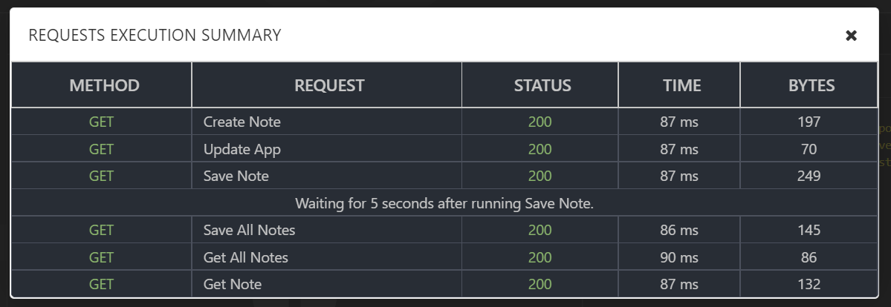

# insomnia-plugin-exec-suite

An Insomnia plugin to run all or conditional requests in a folder. Via plugin, user can `SKIP` a particular request, `WAIT` after a particular request has run or can `STOP` execution at a certain request. It also supports root level and request level `RETRY` options.

## TLDR;
Clicking on `Execute All Requests` folder menu item will execute all requests.
1. `SKIP`: Skips the current/marked request irrespective of being placed as prefix or suffix.
2. `STOP`: Execution flow will stop before (if placed as prefix) or after (if placed as suffix) executing marked request.
3. `WAIT(seconds)`
    1. Will await before (if placed as prefix) or after (if placed as suffix) executing marked request.
    2. Waiting numbers are given in brackets in seconds. For example `` `WAIT(10)` `` means wait for 10 seconds.
4. `RETRY(count)`
    1. During execution, if any request does not return `200` status code, that request will be retried again for number of counts mentioned in brackets.
    2. When placed on folder, retry settings are applicable for all requests inside folder. When placed on request, settings will be appicable only for that request and will override folder settings.

## Usage

The Plugin can be used to send all requests in a folder.

#### Modify Folder run.
We can add some attributes to each request like `WAIT`, `SKIP` and `STOP` inside double back ticks (``).

1. `WAIT(10)`
When running all requests in the folder:
    1. If `WAIT` is present in front of the request name (example would be `` `WAIT(10)` Save Note``) execution will wait `BEFORE` running the current request.
    2. If `WAIT` is present in after the request name (example would be `` Save Note `WAIT(10)` ``) execution will wait `AFTER` running the current request.

2. `SKIP`
When running all requests in the folder, execution will SKIP this particular request and continue to execute others as usual.

3. `STOP`
When running all requests in the folder:
    1. If `STOP` is present in front of the request name (example would be `` `STOP` Save Note``) execution will stop at the current request (and current request will not be executed).
    2. If `STOP` is present in after the request name (example would be ``Save Note `STOP` ``) execution will stop after executing current request.

4. `RETRY`
    1. `RETRY` option can be defined at the root level (on folder name) and also on the request level (like any other tag).
    2. Request level `RETRY` tag will retry sending the request if the response's `statusCode` is NOT 200.
    3. Number of retries must be defined in brackets similar to `WAIT` tag. Example would be (``Note-Taking-App `RETRY(3)` ``).
    4. `RETRY` tag can be placed before or after the request name.
    5. If defined on both root level and request level, request level value will be considered and root level value will be ignored for that particular request.

We can use multiple tags separated by comma if needed.

Please find the screenshot below to see the execution plan of the folder.

Also please see the dialog visible after entire folder is ran.

